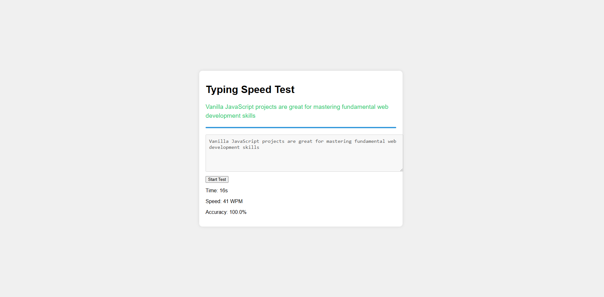
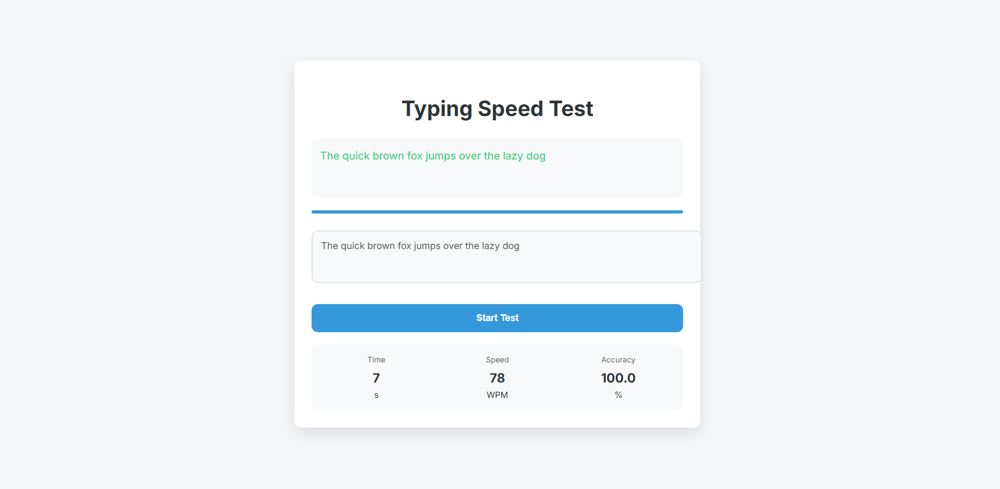
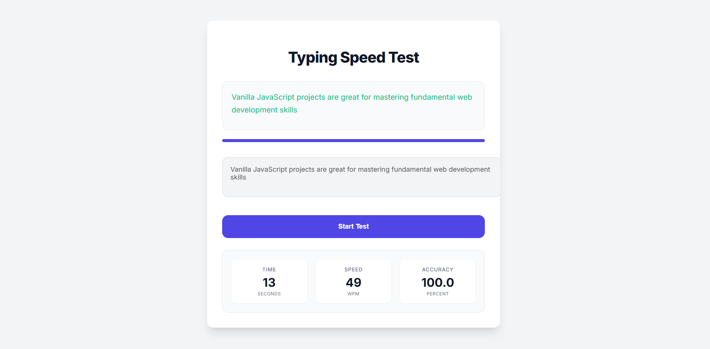
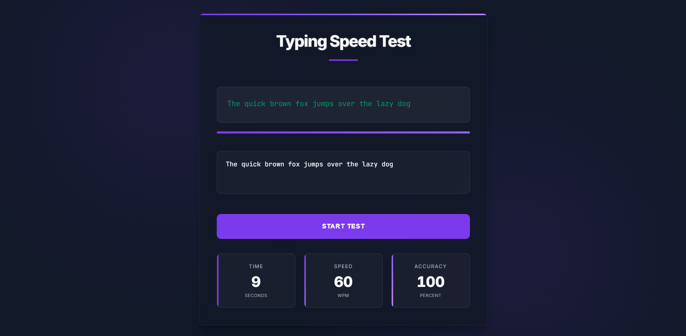

# Typing Speed Test

<div align="center">

[](https://tmhsdigital.github.io/Typing_Speed_Test/)

[](https://github.com/tmhsdigital/Typing_Speed_Test/releases)
[](LICENSE)
[](https://developer.mozilla.org/en-US/docs/Web/JavaScript)
[](https://developer.mozilla.org/en-US/docs/Web/HTML)
[](https://developer.mozilla.org/en-US/docs/Web/CSS)
[](https://www.w3.org/WAI/WCAG2AA-Conformance)
[](https://developer.mozilla.org/en-US/docs/Learn/CSS/CSS_layout/Responsive_Design)
[](https://github.com/tmhsdigital/Typing_Speed_Test/blob/main/package.json)

[](https://www.instagram.com/tmhs.ig/)
[](https://www.linkedin.com/company/tm-hospitality-strategies/)

</div>

---

A simple web application to test your typing speed and accuracy built with vanilla HTML, CSS, and JavaScript.

## 🚀 Quick Start

1. Open the `index.html` file in your browser or visit the [live demo](https://tmhsdigital.github.io/Typing_Speed_Test/)
2. Click the "Start Test" button
3. Type the displayed text as accurately and quickly as possible
4. View your results after completing the text

## ✨ Features

- 🎯 Random text prompts for typing practice
- 🔄 Real-time feedback with character highlighting
- ⚡ WPM (Words Per Minute) calculation
- 📊 Accuracy tracking
- ⏱️ Timer system
- 📱 Responsive design
- ♿ Accessibility support

## 🛠️ Technical Details

### 📁 Project Structure
```
Typing_Speed_Test/
├── index.html      # Main HTML file
├── style.css       # CSS styles
├── script.js       # JavaScript logic
└── README.md       # Documentation
```

### 🔧 Key Components

#### HTML (`index.html`)
- Responsive viewport meta tag
- Accessible textarea with aria-label
- Results display section
- Clean, semantic structure

#### CSS (`style.css`)
- Flexbox-based centering
- Mobile-responsive container
- Visual feedback for correct/incorrect typing
- Modern shadow and border-radius styling

#### JavaScript (`script.js`)
- Random text selection from predefined prompts
- Real-time character comparison
- WPM calculation: `(words / timeElapsed) * 60`
- Accuracy calculation: `(correctChars / totalChars) * 100`
- Timer implementation using `setInterval`

### ⚡ Performance Considerations
- Minimal DOM manipulation
- Efficient string operations
- No external dependencies
- Lightweight implementation (< 100 lines of JS)

## 🌐 Browser Support
- Chrome (latest)
- Firefox (latest)
- Safari (latest)
- Edge (latest)

## 💻 Development

### Prerequisites
- Modern web browser
- Text editor
- Basic understanding of HTML, CSS, and JavaScript

### Local Development
1. Clone the repository
2. Open `index.html` in your browser
3. Start typing!

### Code Style
- ES6+ JavaScript
- BEM-like CSS naming
- Semantic HTML5
- Accessibility-first approach

## 🔮 Future Enhancements

### Planned Features
- Add difficulty levels
- Include more text samples
- Save high scores using localStorage
- Add sound effects
- Create a progress bar
- Implement a countdown before starting

### Potential Improvements
- Add unit tests
- Implement error handling
- Add keyboard shortcuts
- Support for custom text input
- Dark mode support
- Mobile app version

## 🤝 Contributing
1. Fork the repository
2. Create your feature branch
3. Commit your changes
4. Push to the branch
5. Create a Pull Request

## 📄 License
This project is licensed under the MIT License - see the [LICENSE](LICENSE) file for details.

## 📸 Version Screenshots

### Version 1


### Version 2


### Version 3


### Version 4


---

<div align="center">
Made with ❤️ by TMHS Digital
</div>